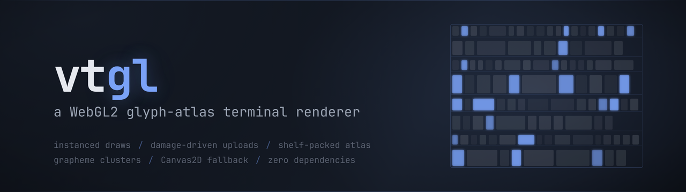
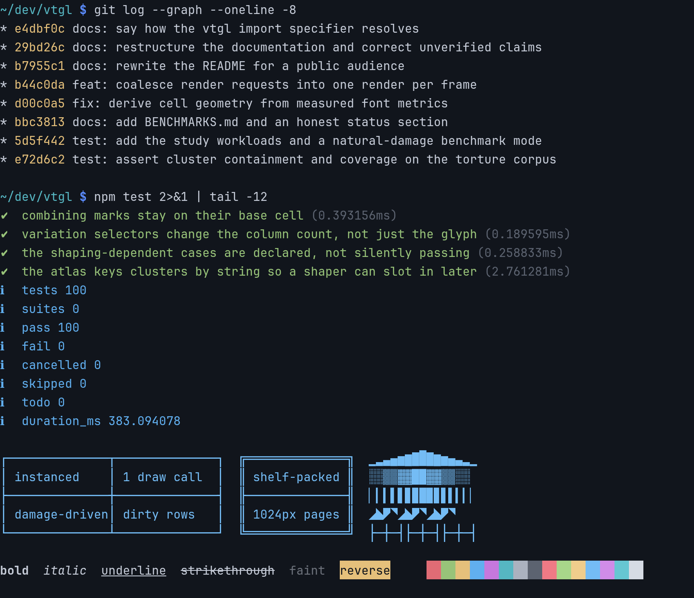
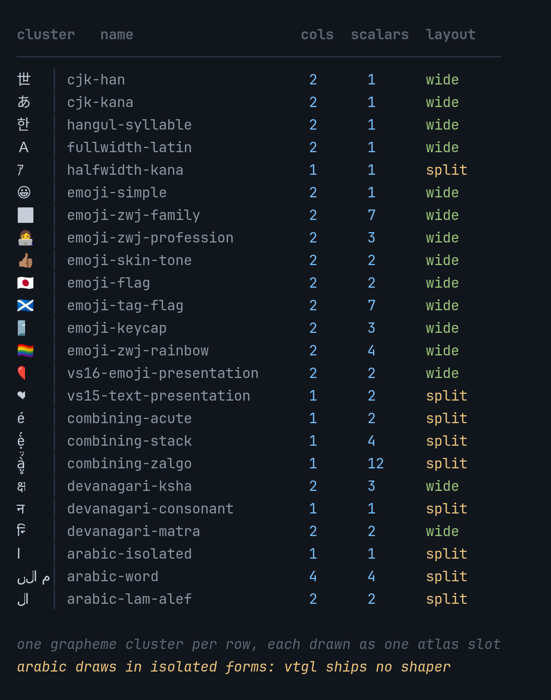
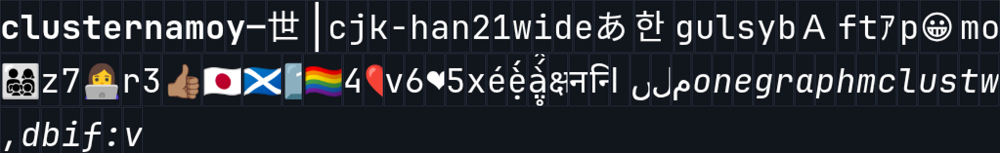
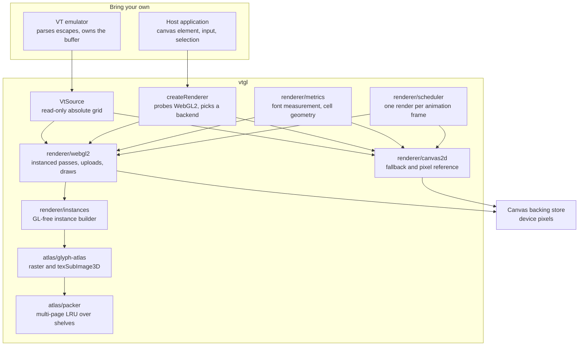

<p align="center">
  
</p>

# vtgl

[](https://deepwiki.com/Gaurav-Gosain/vtgl)

A WebGL2 glyph-atlas terminal renderer for the browser, driven by a VT you supply.

You bring the VT: something that parses escape sequences, owns a scrollback buffer, and can expose its grid one row at a time. vtgl brings the drawing: font measurement, glyph rasterization, atlas packing, instanced draws, damage-driven uploads, hit testing, and a Canvas2D fallback for environments without WebGL2. It has zero runtime dependencies and four development dependencies (esbuild to bundle, typescript to typecheck and emit declarations, `@playwright/test` to drive a real browser, `@types/node` for the build scripts). The shipped artifact is a 56 KB ESM bundle, or a 33 KB minified single file that a browser can import with no build pipeline at all.

It is built to be taken apart. The VT sits behind one read-only interface (`VtSource`), the two backends implement one output interface (`Renderer`), and the pieces underneath (font metrics, render scheduling, shelf allocation, atlas packing, instance building) are exported individually and usable on their own. The instance builder is deliberately GL-free so it can be unit-tested under Node against a fake grid with no GPU present.

## What it draws

Every image below is the WebGL2 backend drawing in a headless chromium, captured
by [scripts/capture](scripts/capture). Nothing is mocked up or retouched, and the
terminal frame is the real output of the two commands it shows, run in this
repository and parsed for SGR.

<table>
  <tr>
    <td></td>
    <td></td>
  </tr>
  <tr>
    <td align="center"><sub>a real frame of 1172 glyph instances in 3 draw calls, from one atlas page</sub></td>
    <td align="center"><sub>the grapheme torture corpus at 1:1, nothing bleeding past its own cells</sub></td>
  </tr>
  <tr>
    <td colspan="2"></td>
  </tr>
  <tr>
    <td colspan="2" align="center"><sub>the atlas page that drew it, read back with <code>readPixels</code> and outlined with the packer's own slot rectangles</sub></td>
  </tr>
</table>

The Arabic rows were the honest failure, and are now the opt-in case: with
`shaper: arabicShaper()` the letters take their contextual forms and the run is
laid out right to left, so a word joins. Reordering is the reason it is opt-in,
and bidi beyond one run of one line is still not done. That and the rest of the
known gaps are in [docs/limits.md](docs/limits.md).

Regenerate the three with `npm run capture`, and the banner with
`node scripts/banner/make-banner.mjs scripts/banner/configs/vtgl.json -o docs/images/banner.png`.

## What it does

- Rasterizes each distinct glyph once into a `TEXTURE_2D_ARRAY` atlas and draws every cell as a textured quad, so a full 120x40 repaint costs 3 to 5 draw calls instead of one `fillText` per cell.
- Keys the atlas by grapheme cluster string plus a bold/italic mask, not by codepoint, so a ZWJ family emoji, a keycap sequence, or a stacked combining mark caches as one entry and draws as one glyph.
- Tints monochrome glyphs per instance from a packed 24-bit foreground rather than baking color into the atlas key, so a log dump carrying 24-bit SGR on every cell causes zero atlas traffic.
- Packs atlas slots with a shelf allocator across up to four 1024x1024 pages, evicting by LRU with a whole-atlas flush and a generation counter the renderer watches to restart a frame that was invalidated mid-build.
- Reads damage from the source's own `isRowDirty` and uploads only the changed rows, coalescing contiguous dirty rows into one `bufferSubData` per instance stream.
- Draws backgrounds, glyphs, and decorations as three separate instanced passes over `cols * rows` instances each, with blank and spacer-tail cells emitting zero-area quads so the GPU never branches per cell.
- Handles wide cells by the VT's own width report: a width-2 head takes a two-cell atlas slot, and the width-0 spacer tail that follows it is skipped rather than drawn.
- Derives cell width, height, and baseline from the font's measured `fontBoundingBoxAscent` and `fontBoundingBoxDescent` rather than from the nominal font size, falling back to the ink box of a tall-and-deep sample and then to proportions of the size.
- Coalesces any number of render requests inside one animation frame into a single render, and defers a request made during a render to the following frame instead of re-entering.
- Falls back to a Canvas2D renderer implementing the identical `Renderer` interface, selected automatically by `createRenderer`, sharing the cell-metric code so both backends land on the same geometry.
- Survives `webglcontextlost` and `webglcontextrestored`, rebuilding programs, buffers, and the atlas and forcing a full redraw.
- Maps CSS pixels to cells and back for hit testing, and emits a `cursorMove` event when the cursor's absolute position or shape changes.
- Reports per-frame `RenderStats` (dirty rows, glyph instances, draw calls, atlas uploads, whether the frame was full, and CPU milliseconds inside `render()`), which is what the benchmark suite measures.
- Applies faint as an alpha scale and blink as a 500 ms gate in the glyph fragment shader; both are per-instance style bits, so neither enters the atlas key.
- Ships a scriptable `FakeSource`, ten golden scenarios, and a 24-entry Unicode grapheme torture corpus, so the renderer can be tested and benchmarked with no VT wired up.

## Design goals

- **Small.** The renderer draws. It does not parse escape sequences, own a buffer, touch the clipboard, speak a wire protocol, or load fonts beyond the family and size passed to its constructor.
- **Pluggable.** State arrives through one read-only interface. The reference source is ghostty-vt compiled to wasm, whose cell model `VtSource` mirrors, but nothing in the renderer imports a VT.
- **Flat.** Per-frame CPU cost tracks damaged rows, and draw-call count stays fixed as the grid grows. Both properties are asserted by the browser suite rather than assumed.
- **Quiet.** No per-cell allocation in the hot path. A full 120x40 repaint of 4703 glyphs allocates 321 bytes, all of it the short-lived atlas key string.
- **Honest.** The docs state what is measured and what is not, which contract fields are wired and which are declared but inert, and where the shipped behaviour is correct but pessimistic. [docs/limits.md](docs/limits.md) is that list.

## Architecture



The subgraph boundary is the whole design: the left column is yours and the right column never imports it. `VtSource` is the only way state enters, and it is consumed strictly read-only, including the dirty flags, which the renderer reads and never clears.

`createRenderer` probes for a WebGL2 context on a throwaway canvas and returns `WebGL2Renderer` when it exists, `Canvas2DRenderer` otherwise, typed as `Renderer` either way so callers never branch on backend. The Canvas2D path is not a stub: it is the correctness reference the WebGL2 path is compared against, and it wins on nearly empty screens, where skipping most cells beats drawing a full grid of mostly degenerate quads.

`renderer/instances.ts` is GL-free on purpose. It turns a `VtSource` row into three typed-array slices (backgrounds, glyphs, decorations) through a `GlyphProvider` interface that the GL atlas implements and tests fake, which is how instance generation stays covered by Node tests with no GPU in the process.

## The frame pipeline

```mermaid
flowchart LR
  REQ[requestRender<br/>source plus viewportY] --> COAL{frame already booked?}
  COAL -- yes --> DROP[coalesce<br/>counted, not queued]
  COAL -- no --> RAF[next animation frame]
  RAF --> FULL{full redraw?<br/>mount, resize, theme,<br/>scroll past a viewport}
  FULL -- yes --> ALL[rebuild every row]
  FULL -- no --> SHIFT[shift by the scroll delta:<br/>rotate slots, or blit the canvas]
  SHIFT --> DIRTY[rebuild rows the scroll uncovered<br/>plus rows where isRowDirty is true]
  ALL --> ROW[buildRow<br/>background, glyph, decoration instances]
  DIRTY --> ROW
  ROW --> KEY[atlasKey<br/>grapheme plus bold/italic mask]
  KEY --> HIT{slot cached?}
  HIT -- no --> RAST[fillText to a 2D scratch canvas<br/>texSubImage3D into a page]
  HIT -- yes --> RECT[cached slot rect]
  RAST --> RECT
  RECT --> UP[bufferSubData<br/>one call per contiguous dirty run]
  UP --> DRAW[3 to 5 instanced draws<br/>background, glyphs, decorations, cursor]
```



Every stage after the damage test is proportional to dirty rows, not to grid size. A clean frame walks `rows` calls to `isRowDirty`, uploads nothing, and still issues the draws, because the instance buffers already hold the whole grid: redrawing unchanged content costs GPU fill, not CPU work.

The atlas can invalidate a frame from underneath the builder. When a miss cannot be placed even after growing to the page cap, the packer flushes every entry and bumps a generation counter, which makes every rect resolved earlier in the same frame stale. The renderer notices the generation change and restarts the build as a full frame into the fresh atlas, up to three attempts; if the last attempt still churns, it arms a full redraw for the next frame rather than leaving the screen wrong.

Scrolling is a change of `viewportY`, not a write, so no row reports dirty. Instead of rebuilding, the renderer shifts. WebGL2 addresses its instance streams by slot rather than by screen row and keeps a rotating slot-to-row map in a uniform, so a scroll of n rows is a change to that uniform plus a rebuild of the n rows that entered the viewport; nothing in the instance data encodes a screen position, which is the invariant the rotation rests on. Canvas2D does the same thing in pixels, blitting the canvas onto itself and repainting the n rows the blit uncovered. Rows that both moved and changed are rebuilt, so scroll and damage in one frame come out the same as a full repaint. A jump larger than the viewport has nothing to reuse and falls back to a full rebuild.

That equivalence is asserted rather than argued: the browser suite renders scrolled frames through the fast path and through a forced full rebuild and requires the two to be pixel-identical, on both backends, including the scroll-plus-write case.

## Quick start

vtgl is not published to npm. Clone and build it, then import the bundle or vendor the single file:

```bash
git clone https://github.com/Gaurav-Gosain/vtgl
cd vtgl
npm install
npm run build          # dist/index.js (56 KB ESM) + dist/*.d.ts
npm run build:vendor   # dist/vtgl.vendor.js (33 KB minified, dependency-free)
# the vendor bundle carries a banner with the version and git revision it was
# built from, and a browser can import it directly with no npm pipeline
```

Node 24 or newer is required for the type-stripping test runner; the build itself needs only esbuild and typescript.

The examples below import from `vtgl`, which is the package name in
`package.json`. Since there is nothing to install from the registry, make that
specifier resolve by installing the checkout itself (`npm install /path/to/vtgl`
from your project), or import `dist/index.js` by path. `dist/vtgl.vendor.js` is
minified ESM with the same named exports, so a page served over http can
`import { createRenderer } from './vtgl.vendor.js'` from a `<script type="module">`
with no npm involved at all. That last route needs a real origin rather than a
`file://` path, because browsers refuse module scripts over `file://`.

A minimal mount, in order (`mount` before `resize`, `resize` before `render`):

```ts
import { createRenderer } from 'vtgl';

const canvas = document.querySelector('canvas')!;

const renderer = createRenderer({
  fontFamily: '"JetBrains Mono", monospace',
  fontSize: 14,
  lineHeight: 1.2,
  dpr: window.devicePixelRatio,
  theme: { foreground: 0xd0d0d0, background: 0x101010, cursor: 0xffffff },
  // ghostty-vt pre-resolves inverse video; a source that does not should set
  // this true and let the renderer swap fg/bg on CellFlags.INVERSE.
  resolveInverse: false,
});

renderer.mount(canvas);
renderer.resize(80, 24, window.devicePixelRatio);

// The renderer sizes the backing store (canvas.width/height) and nothing else.
// CSS size is yours; getMetrics() reports both device and CSS cell dimensions.
const m = renderer.getMetrics();
canvas.style.width = `${m.canvasWidth / m.dpr}px`;
canvas.style.height = `${m.canvasHeight / m.dpr}px`;

// viewportY is the ABSOLUTE row drawn at the top of the viewport. With no
// scrollback scrolled into view, that is source.scrollbackRows.
renderer.render(source, source.scrollbackRows);
```

A realistic loop leans on the source's damage tracking and lets the scheduler collapse bursts into one render per frame:

```ts
let viewportY = source.scrollbackRows;

// requestRender coalesces any number of requests inside one animation frame
// into a single render. The driver, not the renderer, owns dirty state.
renderer.on('render', () => vt.clearDirty());
vt.onData(() => renderer.requestRender(source, viewportY));

// Scrolling is a viewport move, not a write.
canvas.addEventListener('wheel', (e) => {
  const max = source.scrollbackRows;
  viewportY = Math.max(0, Math.min(max, viewportY + Math.sign(e.deltaY) * 3));
  renderer.requestRender(source, viewportY);
});

// Hit testing. cellAtPixel returns a VIEWPORT row (0..rows-1); add viewportY
// yourself for the absolute buffer row.
canvas.addEventListener('mousedown', (e) => {
  const r = canvas.getBoundingClientRect();
  const cell = renderer.cellAtPixel(e.clientX - r.left, e.clientY - r.top);
  if (cell) console.log('absolute row', viewportY + cell.row, 'col', cell.col);
});

// Per-frame instrumentation.
renderer.on('render', (s) => {
  console.log(s.dirtyRows, s.glyphs, s.drawCalls, s.atlasUploads, s.cpuMs);
});
```

Both examples assume a source whose grid matches the size passed to `resize()`. If it does not, `render()` adopts the source's `cols` and `rows` and resizes itself, which forces a full redraw and, on the WebGL2 path, rebuilds the atlas. For experimenting before a VT is wired up, `FakeSource` in [src/testing/fake-source.ts](src/testing/fake-source.ts) is a scriptable absolute grid implementing `VtSource`, and [src/testing/scenarios.ts](src/testing/scenarios.ts) builds nine populated grids from it.

## The VtSource contract

Implementing `VtSource` is how you adopt vtgl, so the summary here is the part adapters get wrong; [docs/api.md](docs/api.md) is the full reference.

Row coordinates are absolute across the whole buffer:

```
row in [0, scrollbackRows)                     -> scrollback, oldest first
row in [scrollbackRows, scrollbackRows + rows) -> the active screen
```

`render(source, viewportY)` draws `rows` lines starting at absolute row `viewportY`, so `viewportY === scrollbackRows` means "bottom, no scrollback visible" and `viewportY === 0` means "scrolled to the very top". A VT that reports screen-relative rows plus a separate scrollback accessor needs a mapping layer. `viewportY` is an absolute row, not a scroll offset.

```ts
interface VtSource {
  readonly rows: number;            // visible viewport height
  readonly cols: number;            // width in columns
  readonly scrollbackRows: number;  // rows available above the active screen

  getLine(row: number): LineView;   // allocation-free column accessor
  getCell(row: number, col: number): Cell;
  getGraphemeString(row: number, col: number): string;
  getCursor(): CursorState;

  // True if the absolute row changed since the driver last cleared dirty
  // state. A source with no damage tracking may return true always, which is
  // correct and slower.
  isRowDirty(row: number): boolean;

}
```

The rules an implementation must honour:

- **`width` is display columns**: 1 normal, 2 for a wide cell (CJK, most emoji), 0 for the spacer tail that follows a wide cell. The renderer skips width-0 columns; getting this wrong is what makes CJK overlap.
- **`grapheme` returns the whole cluster**, not the first scalar. A ZWJ family emoji is one string on the head cell. The atlas keys on that string, which is what makes cluster rendering correct without a shaper.
- **`codepoint` 0 or 32 marks a blank cell**, which lets both backends skip glyph work while still painting the background.
- **Colors are already resolved.** `fg` and `bg` are packed 24-bit `0xRRGGBB`, and no palette lookup happens anywhere in the renderer. If your VT reports a sentinel for "use the terminal default" (ghostty-vt reports `rgb(0, 0, 0)`), your adapter substitutes the theme's foreground and background, or you draw black on black.
- **Inverse** is either pre-resolved by you or applied by the renderer when `resolveInverse: true`. Do not do both.
- **`flags`** is a bitfield of `CellFlags`: `BOLD`, `ITALIC`, `UNDERLINE`, `STRIKETHROUGH`, `INVERSE`, `INVISIBLE`, `BLINK`, `FAINT`. The values match ghostty-vt's layout, so the reference adapter passes wasm flags through unchanged.
- **`isRowDirty` is read-only for the renderer.** Whoever drives the source clears dirty state, out of band from `render()`.

`getCursor()` returns `{ x, y, visible, shape }`, where `x` is a 0-based column and `y` is an absolute buffer row. Both backends honour `visible` and `shape`. There is no `blink` field, because the renderer has no clock to blink against; a host that wants a blinking cursor owns the timer:

```js
setInterval(() => {
  cursorVisible = !cursorVisible;      // your source returns this from getCursor()
  renderer.requestRender(source, viewportY);
}, 530);
```

## The Renderer interface

```ts
interface Renderer {
  readonly backend: 'webgl2' | 'canvas2d';

  mount(canvas: HTMLCanvasElement | OffscreenCanvas): void;

  render(source: VtSource, viewportY: number): void;        // draw now
  requestRender(source: VtSource, viewportY: number): void; // coalesce to next frame
  flushRender(): void;                                      // draw any booked frame now

  resize(cols: number, rows: number, dpr: number): void;    // forces a full redraw
  setTheme(theme: Theme): void;                             // forces a full redraw
  getMetrics(): Metrics;

  cellAtPixel(px: number, py: number): CellCoord | null;    // CSS px -> viewport cell
  pixelForCell(col: number, row: number): PixelRect;        // viewport cell -> CSS px

  on<K>(event: K, handler: (payload) => void): () => void;  // returns an unsubscribe
  off<K>(event: K, handler: (payload) => void): void;

  dispose(): void;
}
```

`RendererOptions` takes `fontFamily`, `fontSize`, optional `lineHeight` (default 1.2), `letterSpacing`, `dpr`, a `theme`, `resolveInverse`, and an optional `shaper` (see `arabicShaper()`), honoured by both backends and absent by default. `getMetrics()` reports device-pixel and CSS-pixel cell sizes, the baseline offset, the backing-store size, and the resolved font settings, which is what a host needs to keep its own geometry in sync. Events are `render` (a `RenderStats`) and `cursorMove` (a `CellCoord` carrying an absolute row).

Arabic joining is off unless you ask for it:

```ts
import { createRenderer, arabicShaper } from 'vtgl';

const renderer = createRenderer({
  fontFamily: 'monospace',
  fontSize: 14,
  theme,
  // Joins Arabic and lays each run out right to left. That reordering means a
  // cell's index and the column its character is drawn in stop agreeing inside
  // a shaped run, so leave this off if hit testing has to match the buffer.
  shaper: arabicShaper(),
});
```

Also exported: `supportsWebGL2()`, `arabicShaper`, `RowShaper`, `RenderScheduler`, `computeCellMetrics`, `measureFont`, `GlyphAtlas`, `AtlasPacker`, `ShelfAllocator`, `atlasKey`, `atlasKeyBaked`, `styleMask`, `InstanceBuffers`, `StyleBit`, the color helpers (`rgb`, `toCss`, `quantize`), and `Emitter`. [docs/extending.md](docs/extending.md) covers which of these are seams and what each costs to replace.

## Performance

Measured with `npm run bench:browser` on a 120x40 grid in headless chromium, every visible row forced dirty each frame so each scenario is a worst-case full-screen repaint, 60 frames after a 10-frame warmup. Figures are mean CPU milliseconds inside `render()`. Full tables, the natural-damage run, allocation sampling, and the methodology caveats are in [docs/benchmarks.md](docs/benchmarks.md).

| scenario | webgl2 cpu | canvas2d cpu | ratio | webgl2 draws | canvas2d `fillText` |
| --- | --- | --- | --- | --- | --- |
| ascii | 0.67 ms | 3.58 ms | 5.4x | 5 | 4080 |
| cjk | 0.50 ms | 2.07 ms | 4.1x | 5 | 2390 |
| emoji | 0.52 ms | 1.44 ms | 2.8x | 5 | 1560 |
| churn | 0.83 ms | 7.05 ms | 8.5x | 5 | 4702 |
| dump | 1.17 ms | 3.41 ms | 2.9x | 5 | 3870 |
| scrollstorm | 0.71 ms | 5.16 ms | 7.3x | 3 | 3663 |
| altscreen | 0.43 ms | 1.00 ms | 2.3x | 5 | 1080 |
| tui | 0.26 ms | 0.24 ms | 0.9x | 4 | 125 |
| blank | 0.20 ms | 0.11 ms | 0.6x | 4 | 31 |

Read these as relative signals only. Headless chromium runs WebGL on SwiftShader, which rasterizes on the CPU, so GPU-side cost in that environment is software emulation and no frame rate is claimed anywhere in this repository. What transfers is the CPU column (grid walking and buffer building, which a real GPU does not remove), the draw-call counts, and the allocation figures. What remains genuinely unmeasured is GPU cost on real hardware.

Blank and tui are the two cases Canvas2D wins or ties. Both are nearly empty screens, and skipping almost every cell beats uploading and drawing a full grid of mostly degenerate quads. That is a real property of the design, not noise.

## Limitations

The full list, with the reasoning and the memory ceilings, is [docs/limits.md](docs/limits.md). The ones that decide whether vtgl fits:

- **Contextual shaping is opt-in, Arabic only, and is not bidi.** `shaper: arabicShaper()` makes Arabic join: both backends group contiguous Arabic cells into a run, ask the browser for each letter's contextual form via a joining context, lay the run out right to left, and fit each glyph's advance to its cell so the strokes meet. Verified against the Unicode presentation forms, which the shaped output matches to 10 pixels in 736 where the unshaped output is 176 away. What it is not: it is not the Unicode Bidirectional Algorithm, word order across a space is not reversed, there is no lam-alef ligature, and only U+0600..U+06FF is covered. It is off by default because reversing a run breaks the identity between a cell's index and the column its character is drawn in, so `cellAtPixel` inside a shaped run names a cell whose character sits elsewhere in that run. Cost is unmeasurable on content with no Arabic and roughly 2x (WebGL2) to 3x (Canvas2D) of render CPU on an all-Arabic screen.
- **A scroll larger than the viewport repaints in full.** Scrolling inside the viewport shifts instead of rebuilding, so an n-row scroll costs n rows on both backends: `scrollstorm` at natural damage went from 40 dirty rows to 3, and from 1.10 ms to 0.14 ms of WebGL2 CPU. Past a viewport's worth of movement nothing on screen survives and the frame is rebuilt, so a page-down still costs a full frame.
- **A DPR change rebuilds rather than rescales.** Cell geometry drove the atlas slot sizes, so `resize()` with a new device pixel ratio throws the whole atlas away and re-rasters every glyph over the following frames.
- **Blink needs a driver.** Cell blink works on both backends and is asserted in real pixels on each, but the renderer runs no clock: a blinking cell only visibly toggles while something keeps calling `requestRender`. Cursor blink is not implemented and is not in the contract; a host that wants one toggles `visible` on its own timer.
- **Benchmarks were measured under software rasterization.** Only the CPU-side figures, the draw-call counts, and the allocation numbers transfer to real hardware. See [docs/benchmarks.md](docs/benchmarks.md).
- **Pixel parity is a tolerance, over part of the corpus.** Four golden scenarios are compared under a 2% differing-pixel budget and the emoji scenario under 5%, not all ten and not pixel-exact. The 24-entry torture corpus is compared by ink coverage per cell rather than per pixel, because those rows are mostly background and a subpixel shift swings the differing-pixel fraction while nothing is wrong.
- **Wide glyphs are clipped, not bled.** A glyph whose font advance exceeds the cells the VT assigned it is clipped by its atlas slot, where Canvas2D lets it paint outside. Measured on the torture corpus, Canvas2D bleeds into the next cell on 9 of 24 entries and the WebGL2 path on none. Both behaviours are defensible; the tests record each rather than pretending they match.
- **One contract surface is still declared and inert.** `atlasKeyBaked` and `quantize` are exported for a baked foreground-quantized atlas mode that is not implemented. `Theme.selection`, `Theme.palette`, `VtSource.getMode`, `CursorState.blink` and the `bell` event used to be on this list and were removed instead, because a field a consumer can set and the renderer ignores is a trap rather than an extension point. `RendererOptions.shaper` was on it too and is now honoured by both backends.
- **No selection overlays, ligatures, or subpixel antialiasing.** A ligature is several cells collapsing into one glyph, and the renderer draws one glyph per cell, so the run grouping shaping added does not get there on its own. A host that wants selection draws its own overlay over the canvas.

## Tests

```
npm run typecheck
npm run test          # 128 unit tests under node:test
npm run test:browser  # 27 Playwright tests against the system chromium
npm run build
npm run check         # all of the above, in order
```

The unit tests cover the shelf allocator, the multi-page packer, atlas keying, cell metrics, the render scheduler, the instance builder against a fake glyph provider, the Canvas2D renderer against a recording canvas, the fake source, and the grapheme torture corpus. The browser tests cover backend selection, pixel parity against the Canvas2D reference, draw-call flatness across three grid sizes spanning a 120x cell-count range, damage-driven upload counts, pixel-exact equivalence between the scroll fast path and a full rebuild on both backends (with and without a shaper configured, since a reordering shaper is the thing most likely to smear under a shift), the shaped Arabic word against the Unicode presentation forms, blink toggling in real pixels, atlas cache-hit behaviour, context-loss recovery, and per-cluster ink and bleed on the torture corpus.

The browser suite drives the system chromium at `/usr/bin/chromium` and downloads no browser binaries; point `VTGL_CHROMIUM` at another executable to override. It loads the harness from disk over a `file://` URL, so no static server is involved, and it runs with `--disable-lcd-text` and `--force-device-scale-factor=1`, which means parity is verified under grayscale antialiasing at one device pixel ratio only.

`npm run bench` reports Canvas2D draw-decision counts under Node against a recording canvas. `npm run bench:browser` reports per-frame cost, draw calls, atlas traffic, and sampled allocation for both backends in the browser.

## Comparison with xterm.js

xterm.js is the obvious alternative and, for most people, the right answer. It is mature, exposed to production everywhere, and it is a complete terminal: parser, buffer, input handling, selection, links, accessibility, addons. vtgl is a renderer and nothing else, and it has had none of the same exposure.

The renderer architecture is not the differentiator. The xterm.js WebGL addon takes the same approach vtgl does, a glyph atlas with instanced draws, and vtgl's font-measurement and render-scheduling modules deliberately follow theirs (see [THIRD-PARTY.md](THIRD-PARTY.md)). Expect comparable rendering performance, not a leap. The two real differences are that the VT is pluggable, so a wasm VT or a server-side one can keep its own cell model and still get a GPU renderer, and that grapheme correctness comes from the source rather than from an independent guess about Unicode, since the atlas keys on the cluster string the VT segmented.

If you want a terminal, use xterm.js. If you are building one and want to own the VT, vtgl is the renderer half.

## Project

- [docs/architecture.md](docs/architecture.md), the atlas key scheme, the instanced pipeline layout, the damage and upload strategy, and the fallback contract.
- [docs/api.md](docs/api.md), the full public contract.
- [docs/extending.md](docs/extending.md), the seams and what each costs to replace.
- [docs/limits.md](docs/limits.md), hard ceilings, known gaps, and what vtgl is not for.
- [docs/benchmarks.md](docs/benchmarks.md), measurements with their conditions.
- [THIRD-PARTY.md](THIRD-PARTY.md), provenance.

## License

MIT. See [LICENSE](LICENSE).

The renderer is fresh code and vendors no third-party source. Two modules follow approaches taken in xterm.js (also MIT): the font measurement in [src/renderer/metrics.ts](src/renderer/metrics.ts) and the render scheduling in [src/renderer/scheduler.ts](src/renderer/scheduler.ts). vtgl mirrors the cell model of ghostty-vt (MIT) and takes conceptual cues from the MIT-licensed ghostty-web Canvas2D renderer, but shares code with neither.
