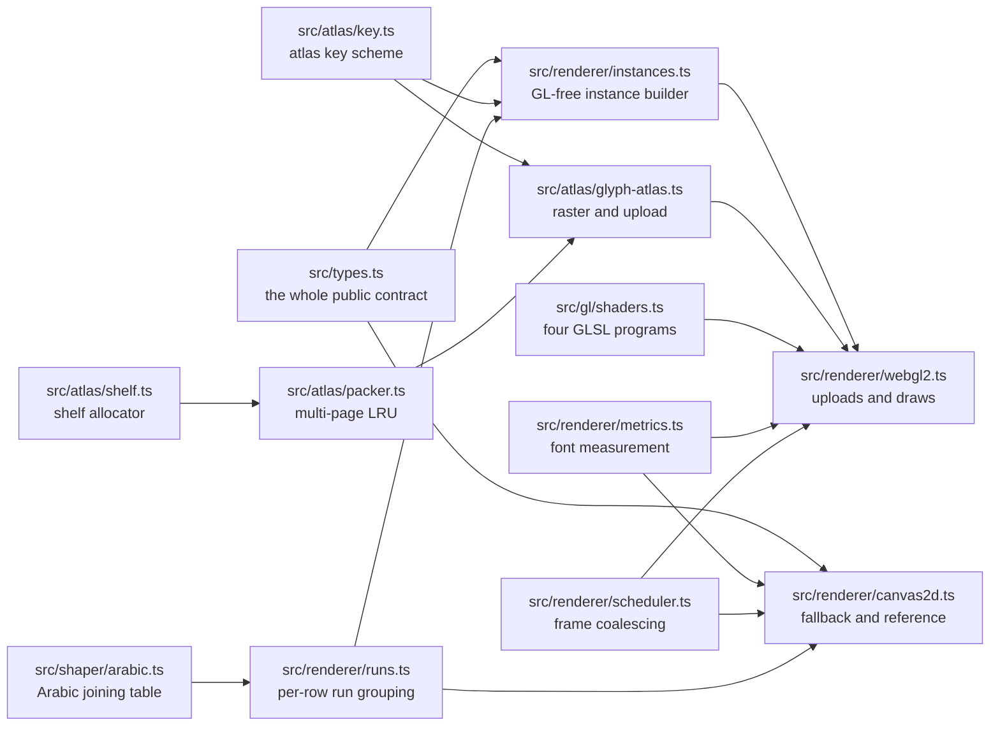
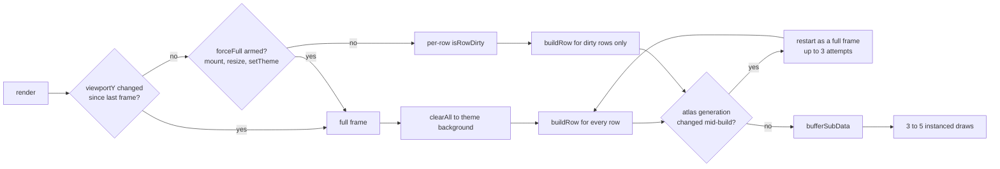

# Architecture

This document describes what the code does today. Where a decision was made for
a capability that has not landed (a baked-foreground atlas mode), that is said
explicitly rather than described in the present tense.

## Package layout



Only two modules import WebGL types: `renderer/webgl2.ts` and
`atlas/glyph-atlas.ts` (plus `gl/program.ts`, which is a helper for both).
Everything else is pure enough to run under `node --test`, which is why 122 unit
tests cover the shelf allocator, the packer, key generation, cell metrics, the
scheduler, the instance builder, the run grouping, the Arabic shaper, and the
Canvas2D renderer with no GPU in the process.

`src/types.ts` carries no logic. It is the file to read first, and the file a
host reads to write an adapter.

## The source contract

The renderer consumes `VtSource` strictly read-only. It never mutates the source
and never clears dirty state; whoever drives the VT owns the dirty lifecycle and
clears it out of band from `render()`.

Row coordinates are absolute across the whole buffer. Rows `[0, scrollbackRows)`
are scrollback, oldest first; rows `[scrollbackRows, scrollbackRows + rows)` are
the active screen. `render(source, viewportY)` draws the `rows` lines starting at
absolute `viewportY`, so scrolling is a different `viewportY` and nothing else.

`getLine(row)` returns a `LineView` of numeric column accessors rather than an
array of `Cell` objects. This is deliberate: the inner loop must not allocate a
cell per cell per frame. `grapheme(col)` is the only accessor that may allocate,
and it is called only for cells that are non-blank, non-invisible and
non-spacer. The `Cell` struct exists for `getCell()` and for host convenience;
no render path constructs one.

Width semantics drive both backends. A width-2 cell is the head of a wide glyph
and the cell after it is a width-0 spacer tail that must be skipped, never drawn.
A blank cell is codepoint 0 or 32.

## Atlas key scheme

The atlas is a cache from a rasterizable-glyph identity to a rectangle in a
texture page. The identity is a string. Keying by string is the load-bearing
decision: it is what lets a contextual shaper mint per-shaped-glyph keys that
slot into the same atlas the per-grapheme path uses. `arabicShaper` does exactly
that, in its own key namespace so a fitted raster cannot displace the plain
entry for the same letter.

Default, tinting mode (`atlasKey`):

```
key       = grapheme + "" + styleMask
styleMask = flags & (BOLD | ITALIC)   // the only flags that change glyph shape
```

Monochrome glyphs are rastered white on transparent and stored as coverage; the
fragment shader tints them by the per-instance foreground, so foreground is not
part of the key. That collapses the atlas to one entry per (grapheme,
bold/italic) pair no matter how many colors the text appears in, which is why the
`dump` benchmark (24-bit SGR on every cell) produces zero atlas uploads in steady
state.

Underline, strikethrough, inverse, blink, and faint never enter the key.
Underline and strikethrough are separate decoration quads; inverse is resolved
into the fg/bg values before they reach the instance; faint is an alpha scale and
blink a visibility gate, both per-instance style bits.

Colored glyphs (emoji, including ZWJ sequences) are rastered with their own
colors and drawn untinted. They key by grapheme plus style mask like everything
else, since emoji ignore bold and italic. "Colored" is decided by inspecting the
rastered pixels: a glyph is colored if more than four sufficiently opaque pixels
carry a max-min channel spread above 24. Grayscale antialiased text never trips
that; emoji do. It is a heuristic, and subpixel-antialiased text could in
principle trip it, which is one reason the browser suite runs with
`--disable-lcd-text`.

A baked, foreground-quantized key exists as `atlasKeyBaked`, appending a 5-bit
per-channel bucket of the foreground. It is intended for a variant that bakes
color into the glyph (subpixel antialiasing, where coverage differs per color).
Nothing in the shipped renderers calls it.

## Atlas storage

`AtlasPacker` owns key-to-slot bookkeeping, one `ShelfAllocator` per page, and
the eviction policy, and knows nothing about rasterization or textures.
`GlyphAtlas` drives it, does the raster and upload, and implements the
`GlyphProvider` interface the instance builder consumes.

Pages are 1024x1024 and there are at most 4 of them, both hardcoded as
constructor defaults in `GlyphAtlas` and not exposed through `RendererOptions`.
The backing texture is a single `TEXTURE_2D_ARRAY` with one layer per page,
allocated up front with `texStorage3D(RGBA8)` and sampled with `NEAREST`
filtering and `CLAMP_TO_EDGE` wrapping. The atlas page index rides in the
instance style word (bits 8 to 15) and selects the array layer in the shader, so
a multi-page atlas still costs one texture bind and one draw call.

Slots are packed by shelves: a rectangle goes onto the first shelf that is tall
enough and still has horizontal room, best-fit by shelf height, otherwise a new
shelf opens at the current fill height. A 1 px gutter is added around each slot
so bilinear sampling cannot pull a neighbour's coverage into a glyph edge. Shelf
packing suits this workload because glyph slots cluster into a handful of heights
(one `cellH`, occasionally more), so a full MaxRects allocator would buy little.

Eviction is coarse on purpose. Shelf packing cannot free an individual slot, so
when a miss cannot be placed even after adding a page up to the cap, the packer
flushes every entry, resets every page, and bumps a generation counter. Entries
not touched in the current frame are counted as evictions for diagnostics. The
renderer watches the generation and restarts the frame (see below).

## Instanced pipeline

Geometry is a unit quad expanded from `gl_VertexID` in the vertex shader, so
there is no vertex buffer at all: every pass is
`drawArraysInstanced(TRIANGLE_STRIP, 0, 4, n)`. Three per-cell instance streams
live in preallocated typed arrays sized `cols * rows`, reused frame to frame:

| stream | 32-bit units per instance | instances | contents |
| --- | --- | --- | --- |
| background | 1 | `cols * rows` | packed `0xRRGGBB` |
| glyph | 8 | `cols * rows` | atlas rect (4 floats), glyph offset (2 floats), fg, style |
| decoration | 5 | `cols * rows * 2` | rect (4 floats), color |

The background pass derives its cell from `gl_InstanceID` and `u_cols`, so the
only per-instance datum is the color. The glyph pass does the same and adds the
atlas rect, a device-pixel offset within the cell (zero on the default path,
written from a shaped glyph's `xOffset` otherwise), the packed foreground, and a style word: bit 0 colored,
bit 1 faint, bit 2 blink, bits 8 to 15 the atlas page. Decorations are two
instances per cell, underline and strikethrough, drawn by a solid-rect program
shared with the cursor.

Blank cells, spacer tails, invisible cells, and undecorated cells write a
zero-size rect, which produces a degenerate quad the rasterizer discards. That is
what keeps instance counts fixed and removes per-cell branching from both CPU and
GPU: a frame never resizes a buffer or recounts instances.

Per frame the renderer issues:

1. background, blending off, after a `clear` to the theme background,
2. glyphs, blending on, `SRC_ALPHA / ONE_MINUS_SRC_ALPHA`,
3. decorations,
4. the cursor rect, if the cursor is visible in the viewport,
5. the glyph under a block cursor, if there is one, through a variant vertex
   shader positioned by a `u_origin` uniform instead of `gl_InstanceID`.

Three to five draw calls, independent of cell count. The browser suite asserts
this holds across a 120x range of cell counts.

A width-2 head takes a two-cell-wide atlas slot and emits one glyph instance
whose quad spans both cells; its spacer tail emits a degenerate instance. The
background pass still paints the tail's background, because the wide head writes
the same background color into both cells before the glyph pass runs.

## Damage and upload



On a full frame all three streams are uploaded whole. On an incremental frame the
renderer walks its per-row dirty flags, coalesces contiguous dirty rows into
runs, and issues one `bufferSubData` per run per stream. Byte offsets are
computed inline rather than through the `bgRange`/`glyphRange`/`decoRange`
helpers so the steady-state upload path allocates nothing, not even a range
object. Those helpers remain exported for callers and tests.

The atlas restart deserves the attention. A glyph miss late in a frame can flush
the whole atlas, which invalidates every rect resolved earlier in that same
frame. The renderer snapshots the generation before building, compares after, and
on a change rebuilds everything as a full frame into the fresh atlas. It retries
at most three times; if the last attempt still churns, it arms `forceFull` for
the next frame rather than presenting a frame with stale rects. In practice this
needs a working set larger than four pages to trigger at all.

Scrolling is the one case where damage tracking gives no help. Moving `viewportY`
changes which absolute rows map to which screen rows without dirtying any of
them, so the renderer compares `viewportY` with the previous frame's and forces a
full rebuild when it moved. Correct, and more work than necessary: the instance
data for the overlapping rows is already right and only needs shifting. See
[limits.md](limits.md).

## Frame scheduling

`RenderScheduler` coalesces any number of `schedule()` calls into exactly one
callback on the next animation frame, and drops nothing. A `schedule()` that
arrives during a render is deferred to the following frame instead of re-entering,
so a render that dirties state cannot spin. `flush()` runs a booked frame
immediately and cancels the booking, which is what a resize or a teardown needs.
`coalesced` counts the requests that were folded away, for diagnostics.

Without a document (Node, tests) it falls back to a 16 ms timer, and both the
frame clock and its cancel function are injectable, which is how the scheduler
tests drive frames by hand.

Both renderers hold one scheduler, created lazily on the first `requestRender`,
plus a single pending frame record that later requests overwrite. `render()`
remains public for callers that already own a frame loop.

## Cell geometry

Cell height and baseline come from the font's own vertical metrics, not from the
nominal font size. `measureFont` sets the context font to `${fontSize * dpr}px
${fontFamily}`, measures `M` for the advance, and prefers
`fontBoundingBoxAscent` and `fontBoundingBoxDescent`, which report the face's
declared line box and are therefore stable no matter which characters are on
screen. If the engine reports no font box, it falls back to the ink box of
`Mg|_j`, a sample that reaches both vertical extremes, and finally to 0.8 and 0.2
of the nominal size.

`computeCellMetrics` then rounds the advance plus `letterSpacing * dpr` to a
whole device pixel for the cell width, scales the face's line box by `lineHeight`
for the cell height, and places the baseline where the face puts it with any
extra leading split evenly above and below. Deriving the baseline from the
nominal size instead (a guessed descender fraction, which this module used to
use) lands a pixel or more off on real faces and packs rows tighter than the face
asks for.

Both backends call the same two functions, which is what makes pixel comparison
between them meaningful at all.

## The Canvas2D fallback

The fallback implements the identical `Renderer` interface with a 2D context, and
is also the correctness reference: the WebGL2 core must reproduce its pixel
decisions. Its behaviour:

- **Dirty-row redraw.** A full frame clears the whole backing store to the
  default background once; an incremental frame repaints only rows where
  `isRowDirty(absRow)` is true, each preceded by a default-background band fill
  over that row alone.
- **Blank-cell skip.** A cell with codepoint 0 or 32 whose background equals the
  theme default paints nothing, since the band already covers it. A blank cell
  with a non-default background still fills its rect.
- **Wide-char handling.** A width-2 cell draws its glyph once and spans two
  columns for background and decorations; the width-0 tail is skipped.
- **Caches.** Font strings are cached by bold/italic mask (8 entries), fill
  styles by packed color (512 entries); both clear wholesale when full.
- **Cursor.** Block, bar, or underline. A block cursor overpaints the cell and
  redraws the covered glyph in `cursorText`.

It reports `drawCalls: 1` and `atlasUploads: 0` in `RenderStats`, and its
`glyphs` count is `fillText` calls, which is the honest comparison against the
WebGL path's instance count. It ignores `CellFlags.BLINK` entirely.

One divergence is structural rather than cosmetic. The WebGL2 path repaints the
whole grid every frame from instance data, so a cursor that moves off a clean row
disappears from it automatically. The Canvas2D path only repaints dirty rows, so
if the source does not mark the row the cursor left as dirty, the old cursor stays
on screen. Sources that dirty the cursor's row on movement (the usual case) do not
see this.

## Context loss

`webglcontextlost` is preventDefaulted and sets a flag that makes `render()` a
no-op. `webglcontextrestored` clears it, recreates programs, buffers, vertex
array objects, and the atlas, and arms a full redraw, so the frame after restore
re-rasters every visible glyph. The browser suite forces loss and restore through
`WEBGL_lose_context` and asserts each of those observations.

`GlyphAtlas` also carries an `onContextRestored` method that rebuilds its texture
and flushes the packer. Nothing calls it: the renderer rebuilds the whole atlas
instead. It is dead code today.

## Testing strategy

`FakeSource` is a scriptable absolute grid with explicit dirty tracking, not a
VT. `writeText` lays down ASCII, wide CJK (width-2 head plus width-0 tail) and
ZWJ emoji clusters; `setCell`, `markDirty` and `clearDirty` drive damage
precisely. `getLine` is allocation-free, with one `LineView` bound per row up
front.

Nine golden scenarios build on it: `ascii`, `cjk`, `emoji`, `blank`, `churn`,
plus four study workloads (`dump`, `altscreen`, `scrollstorm`, `tui`) that carry
a `damage` classification and optional `step`/`viewportY` functions, so the
benchmark can run each either at its natural damage or with every row forced
dirty.

The 24-entry torture corpus records, per cluster, the column count and cell
layout a correct grapheme-aware VT produces. Those layouts were measured against
a real ghostty-vt wasm buffer rather than reasoned about, and two of them
contradicted the obvious guess: a Devanagari consonant plus dependent vowel is a
width-2 cluster rather than one column, and the ksha conjunct stays a single
cluster rather than splitting per scalar. Arabic is the one family the VT does
split per cell, which is why joining needs a shaper working across cells rather
than a wider atlas slot; `arabicShaper` is that shaper, and it is opt-in because
it also reorders those cells. The corpus asserts two different things:
that a host adapter agrees with a real VT's segmentation, and that both backends
draw every cluster with comparable ink in the cells the VT assigned it.
